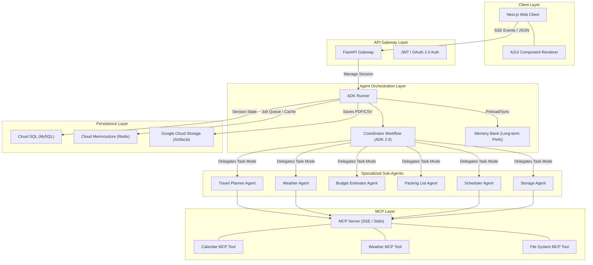

# Aivora Architecture Design

This document details the multi-agent system architecture, technology integration layers, data flows, schemas, and API definitions for Aivora.

---

## 1. System Architecture Diagram
Aivora uses a multi-tiered architecture that separates frontend visualization, API gateway operations, multi-agent coordination, tool execution (via Model Context Protocol), and persistent storage.



---

## 2. Directory Structure
```
aivora/
├── .agent/                       # Agent Context Folder
│   ├── project.md                # Project requirements & profile
│   ├── architecture.md           # Architecture design and system layout
│   ├── tasks.md                  # Development checklist & task list
│   ├── roadmap.md                # Timelines & phases
│   ├── coding-standards.md      # Style guidelines & code norms
│   └── tech-stack.md            # Hardware, software & tooling details
├── app/                          # Core ADK Agent Code (Python)
│   ├── __init__.py
│   ├── agent.py                  # Root Coordinator Workflow (ADK 2.0)
│   ├── config.py                 # Configuration loader & system settings
│   ├── sub_agents/               # Specialized Sub-Agents (task-mode)
│   │   ├── __init__.py
│   │   ├── travel_planner.py     # Sub-agent: itinerary generator
│   │   ├── weather.py            # Sub-agent: weather analyzer
│   │   ├── budget_estimator.py   # Sub-agent: cost calculator
│   │   ├── packing_list.py       # Sub-agent: list maker
│   │   ├── scheduler.py          # Sub-agent: calendar scheduler
│   │   └── storage.py            # Sub-agent: artifact packager
│   ├── tools/                    # Core ADK Tools (Non-MCP)
│   │   ├── __init__.py
│   │   └── memory_helpers.py
│   └── plugins/                  # Core ADK Plugins (Auditing, Guardrails)
│       ├── __init__.py
│       └── model_armor.py        # Input injection filtering
├── mcp_servers/                  # Model Context Protocol Servers
│   ├── calendar/                 # Stdio/SSE Server for Google Calendar API (TS)
│   │   ├── package.json
│   │   └── index.ts
│   └── weather/                  # Weather API wrapper (Python / TS)
├── frontend/                     # Next.js Client
│   ├── src/
│   │   ├── components/           # UI elements & A2UI Renderer
│   │   ├── pages/                # Next.js Pages
│   │   └── styles/
│   ├── tailwind.config.js
│   └── package.json
├── tests/                        # Validation Suite
│   ├── unit/                     # Function & Tool tests
│   ├── integration/              # Backend & DB integration tests
│   └── eval/                     # ADK Systematic Evaluation Suite
│       ├── eval_config.yaml      # Quality benchmarks & thresholds
│       └── datasets/
│           └── test_cases.json   # Scenarios (Delhi trip, etc.)
├── terraform/                    # Infrastructure-as-Code (IaC)
│   ├── main.tf
│   ├── databases.tf
│   └── cloud_run.tf
├── pyproject.toml                # UV configuration
├── Dockerfile                    # Production Container Definition
├── .env.example                  # Environment Variables Template
└── README.md
```

---

## 3. Backend & Orchestration Design
*   **API Framework:** **FastAPI** (Python 3.11+) provides async endpoints for session management, token-streaming via Server-Sent Events (SSE), and WebSockets.
*   **ADK 2.0 Runner:** Development uses `InMemoryRunner`. Production is a distributed runner running on Cloud Run.
*   **Task Mode Execution:** Sub-agents execute as `mode="task"`. Each sub-agent is triggered with a strictly validated Pydantic model (`input_schema`) and returns a structured output schema (`output_schema`).
*   **Workflow Graph:** A declarative pipeline orchestrates sequential and parallel steps:
    ```
                       [START]
                          │
                          ▼
                 [QueryParserNode]
                          │
               ┌──────────┼──────────┐
               ▼          ▼          ▼
          [Travel]    [Weather]   [Budget]  (Parallel Executions)
               │          │          │
               └──────────┼──────────┘
                          ▼
                      [JoinNode]
                          │
                          ▼
                   [PackingList]
                          │
                          ▼
                     [Scheduler] (HITL Gate)
                          │
                          ▼
                      [Storage]
                          │
                          ▼
                       [EXIT]
    ```

---

## 4. Model Context Protocol (MCP) Integration
Aivora interfaces with external systems using MCP to isolate API keys, network endpoints, and execution code from the core LLM space.
*   **Calendar Server (Google Calendar):** Written in TypeScript. Exposes calendar reads and writes. Communicates via stdio in development, and SSE in production.
*   **Weather Server:** Written in Python/TypeScript. Exposes weather checks for current locations and historical climate patterns.
*   **Execution Safety:** Sub-agents invoke MCP tools. Mutating actions (e.g., writing to calendar) are intercepted by a Human-in-the-Loop check in the coordinator before tool execution is allowed to complete.

---

## 5. Database Schema (MySQL)
```sql
-- 1. Users Table
CREATE TABLE users (
    id VARCHAR(36) PRIMARY KEY,
    email VARCHAR(255) UNIQUE NOT NULL,
    password_hash VARCHAR(255) NOT NULL,
    created_at TIMESTAMP DEFAULT CURRENT_TIMESTAMP
);

-- 2. Sessions Table (Stores ADK State)
CREATE TABLE sessions (
    id VARCHAR(36) PRIMARY KEY,
    user_id VARCHAR(36) NOT NULL,
    status VARCHAR(50) DEFAULT 'active',
    state_data JSON, -- Stores key-value state values
    created_at TIMESTAMP DEFAULT CURRENT_TIMESTAMP,
    updated_at TIMESTAMP DEFAULT CURRENT_TIMESTAMP ON UPDATE CURRENT_TIMESTAMP,
    FOREIGN KEY (user_id) REFERENCES users(id) ON DELETE CASCADE
);

-- 3. Events Table (For Session History & Replay/Rewind)
CREATE TABLE events (
    id VARCHAR(36) PRIMARY KEY,
    session_id VARCHAR(36) NOT NULL,
    step_index INT NOT NULL,
    author VARCHAR(100) NOT NULL, -- 'user', 'coordinator', 'travel_planner', etc.
    content JSON NOT NULL,
    state_delta JSON,
    created_at TIMESTAMP DEFAULT CURRENT_TIMESTAMP,
    FOREIGN KEY (session_id) REFERENCES sessions(id) ON DELETE CASCADE
);

-- 4. Travel Plans Table (Parsed Itinerary Cache)
CREATE TABLE travel_plans (
    id VARCHAR(36) PRIMARY KEY,
    session_id VARCHAR(36) NOT NULL,
    destination VARCHAR(255) NOT NULL,
    start_date DATE NOT NULL,
    end_date DATE NOT NULL,
    itinerary JSON NOT NULL,
    budget_estimate DECIMAL(10, 2),
    created_at TIMESTAMP DEFAULT CURRENT_TIMESTAMP,
    FOREIGN KEY (session_id) REFERENCES sessions(id) ON DELETE CASCADE
);

-- 5. Packing Lists Table
CREATE TABLE packing_lists (
    id VARCHAR(36) PRIMARY KEY,
    travel_plan_id VARCHAR(36) NOT NULL,
    item_name VARCHAR(255) NOT NULL,
    category VARCHAR(100),
    is_packed BOOLEAN DEFAULT FALSE,
    FOREIGN KEY (travel_plan_id) REFERENCES travel_plans(id) ON DELETE CASCADE
);

-- 6. Reminders Table
CREATE TABLE reminders (
    id VARCHAR(36) PRIMARY KEY,
    user_id VARCHAR(36) NOT NULL,
    title VARCHAR(255) NOT NULL,
    trigger_time TIMESTAMP NOT NULL,
    external_event_id VARCHAR(255), -- Google Calendar Event ID mapping
    status VARCHAR(50) DEFAULT 'pending',
    FOREIGN KEY (user_id) REFERENCES users(id) ON DELETE CASCADE
);
```

---

## 6. API Endpoint Design

### Session Management
*   `POST /api/sessions` — Initialise a session.
    *   *Payload:* `{ "user_id": "string" }`
    *   *Response:* `{ "session_id": "string", "status": "active" }`
*   `GET /api/sessions/{session_id}/events` — Server-Sent Events stream for agent logs and streaming responses.
*   `POST /api/sessions/{session_id}/message` — Post a message to a session.
    *   *Payload:* `{ "message": "string" }`
*   `POST /api/sessions/{session_id}/resume` — Resume execution after an interrupt (HITL).
    *   *Payload:* `{ "interrupt_id": "string", "response": { "approved": true } }`
*   `POST /api/sessions/{session_id}/rewind` — Rewind session state.
    *   *Payload:* `{ "before_invocation_id": "string" }`

### Artifact Delivery
*   `GET /api/sessions/{session_id}/artifacts/{filename}` — Returns a presigned GCS URL to download the artifact (PDF, CSV).
