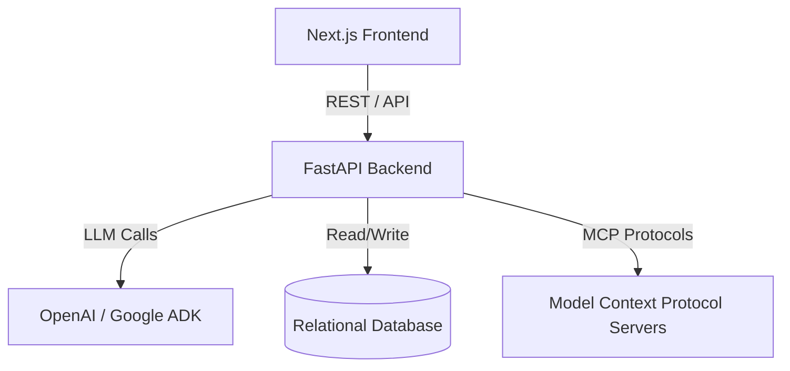
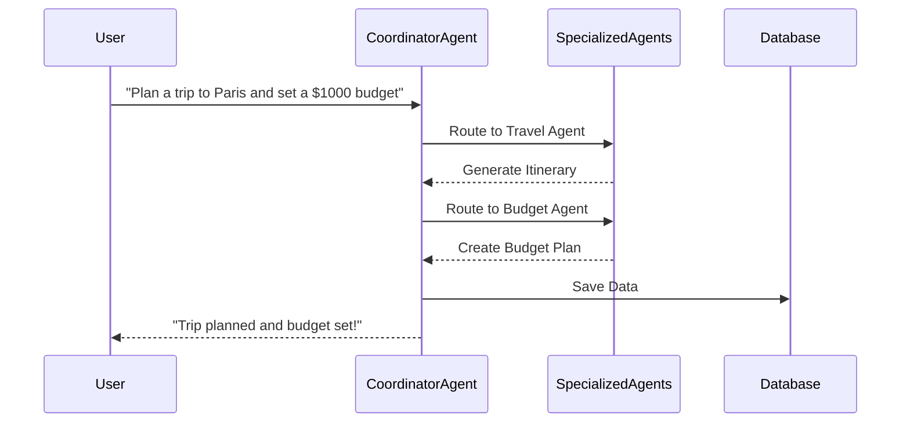
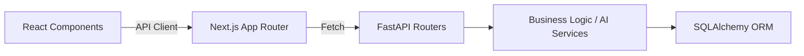
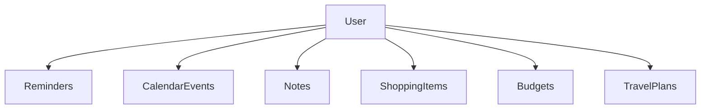
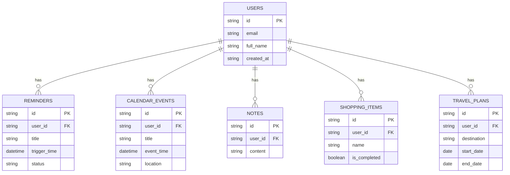

<div align="center">
  
  <h1>Aivora</h1>
  <h3><i>Your Everyday AI Companion</i></h3>
  <p><strong>Kaggle AI Agents Capstone - Concierge Agents Track</strong></p>

  <p>Aivora is a personal AI concierge that helps users organize everyday life using multiple AI agents. Manage reminders, notes, calendars, travel planning, shopping lists, budgeting, and weather through a single, beautifully designed AI assistant.</p>

  <!-- Badges -->
  <p>
    
    
    
    
    
  </p>
</div>

---

## 2. Problem Statement
Managing daily tasks, appointments, budgets, and travel plans typically requires juggling multiple disconnected applications. Users spend too much time navigating between calendar apps, note-taking apps, weather apps, and financial trackers, leading to fragmented information and cognitive overload.

## 3. Solution Overview
Aivora centralizes personal management into a single, unified dashboard powered by a sophisticated multi-agent AI system. Instead of manually organizing life across various platforms, users interact naturally with the Aivora Assistant, which intelligently routes tasks to specialized agents (planning, budgeting, travel) that automate scheduling, list creation, and organization behind the scenes.

## 4. Key Features
- **AI Assistant:** A conversational interface that understands natural language and delegates tasks to specialized AI agents.
- **Calendar:** Automated event scheduling and visualization.
- **Reminders:** Smart, categorized reminders with priority tagging.
- **Notes:** Quick thought capture and activity logging.
- **Travel Planner:** AI-generated itineraries and trip organization.
- **Shopping Lists:** Intelligent, interactive buy-lists.
- **Budget Planner:** Simple, dynamic expense tracking and limits.
- **Weather:** Real-time, location-based forecast integrations.
- **User Authentication:** Secure access powered by Firebase Auth.
- **Personal Dashboard:** A holistic view of the user's daily life, unified in one elegant UI.

## 5. System Architecture

### Overall System


### Multi-Agent Workflow


### Frontend ↔ Backend Flow


### Database Architecture (High-Level)


## 6. Multi-Agent Architecture
Aivora relies on a hierarchical multi-agent system to efficiently tackle user prompts:
- **Coordinator Agent:** The orchestrator that receives the initial user prompt, analyzes intent, and routes tasks to the appropriate sub-agents.
- **Planner Agent:** Handles time management and inserts data into the Calendar system.
- **Reminder Agent:** Extracts time-sensitive tasks and adds them to the Reminder system.
- **Travel Agent:** Designs detailed travel itineraries, suggests destinations, and schedules activities.
- **Budget Agent:** Parses financial data, sets limits, and logs expenses.
- **Shopping Agent:** Identifies purchasable items from conversations and adds them to Shopping Lists.

## 7. MCP Integration
Aivora utilizes the Model Context Protocol (MCP) to standardize external tool access for agents:
- **Calendar MCP:** Provides secure, standardized access to read/write events.
- **Weather MCP:** Fetches real-time weather forecasts and conditions for the dashboard.
- **Maps MCP:** Used by the Travel Agent to calculate distances and fetch location data.
- **File System MCP:** Allows secure, sandboxed storage and retrieval of user-generated artifacts (like generated PDFs or exported itineraries).

## 8. Tech Stack

| Category | Technologies |
| :--- | :--- |
| **Frontend** | Next.js 15 (App Router), React 19, Tailwind CSS, Framer Motion |
| **Backend** | Python 3.13, FastAPI, SQLAlchemy, Pydantic |
| **AI / Agents** | Google ADK, OpenAI APIs, Multi-Agent Orchestration |
| **Database** | SQLite (Local) / Supabase PostgreSQL (Production) |
| **Authentication** | Firebase Authentication, JWT |
| **Deployment** | Vercel (Frontend), Railway (Backend), Supabase (DB) |

## 9. Folder Structure
```text
Aivora/
├── app/                  # FastAPI Backend
│   ├── core/             # Core settings & deps
│   ├── models/           # SQLAlchemy models
│   ├── routers/          # API endpoints
│   ├── schemas/          # Pydantic validation schemas
│   ├── services/         # Business logic & AI agents
│   └── main.py           # FastAPI entry point
├── frontend/             # Next.js Frontend
│   ├── src/
│   │   ├── app/          # Next.js App Router pages
│   │   ├── components/   # React UI components
│   │   ├── lib/          # API client & utilities
│   │   └── styles/       # Global CSS & Tailwind
│   ├── public/           # Static assets
│   └── package.json      # Node dependencies
├── .env.example          # Environment variables template
├── pyproject.toml        # Python dependencies (uv)
└── README.md             # Project documentation
```

## 10. Database Schema



## 11. API Architecture

### Authentication
- `POST /api/v1/auth/verify` - Verify Firebase token and create/get user session.
- `GET /api/v1/auth/me` - Get current authenticated user profile.

### AI Assistant
- `POST /api/v1/assistant/sessions` - Create a new chat session.
- `POST /api/v1/assistant/chat` - Send a message to the AI Coordinator Agent.

### Dashboard & Life Management
- `GET /api/v1/dashboard/summary` - Fetch unified view of reminders, events, and notes.
- `GET /api/v1/dashboard/events` - List calendar events.
- `POST /api/v1/dashboard/events` - Create a new event.
- `POST /api/v1/dashboard/reminders/{id}/complete` - Mark reminder as completed.
- `GET /api/v1/dashboard/notes` - List user notes.
- `POST /api/v1/dashboard/notes` - Create a note.
- `POST /api/v1/dashboard/shopping` - Add item to shopping list.

## 12. Security
- **Firebase Authentication:** Secure login using Google's robust identity platform.
- **JWT (JSON Web Tokens):** Token-based authentication used for secure communication between frontend and backend.
- **Protected Routes:** Next.js middleware and FastAPI dependencies ensure only authenticated users can access personal data.
- **Role-based Authorization:** Strictly limited to a single 'User' role to prevent privilege escalation.
- **Environment Variables:** Secrets (API keys, DB credentials) are managed securely via `.env` files and deployment platform secret managers.
- **Input Validation:** Strict payload validation via Pydantic on the backend prevents injection and malformed data attacks.

## 13. Screenshots

| Landing Page | Login | Dashboard |
| :---: | :---: | :---: |
|  |  |  |

| AI Chat | Calendar | Notes |
| :---: | :---: | :---: |
|  |  |  |

| Travel Planner | Shopping List | Budget Planner |
| :---: | :---: | :---: |
|  |  |  |

<div align="center">
  
  <p><i>Settings</i></p>
</div>

## 14. Installation Guide

### Prerequisites
- Node.js (v18+)
- Python 3.13+ (or `uv` package manager)
- Firebase Account

### Step 1: Clone Repository
```bash
git clone https://github.com/yourusername/aivora.git
cd aivora
```

### Step 2: Backend Setup
```bash
# Create and activate virtual environment using uv
uv venv
source .venv/bin/activate  # On Windows: .venv\Scripts\activate

# Install backend dependencies
uv pip install -r pyproject.toml --all-extras

# Copy environment variables and fill them
cp .env.example .env

# Start the FastAPI server
uv run uvicorn app.main:app --reload --port 8000
```

### Step 3: Frontend Setup
```bash
cd frontend

# Install Node dependencies
npm install

# Copy environment variables and fill them
cp .env.local.example .env.local

# Start the Next.js development server
npm run dev
```

## 15. Environment Variables

Create a `.env` file in the root backend directory:

```env
# Database
DATABASE_URL=sqlite+aiosqlite:///./aivora.db

# OpenAI / AI Providers
OPENAI_API_KEY=sk-your-openai-api-key-here

# Security
JWT_SECRET=your_super_secret_jwt_key
CORS_ORIGINS=http://localhost:3000
```

Create a `.env.local` file in the `frontend` directory:

```env
# API Connectivity
NEXT_PUBLIC_API_URL=http://localhost:8000

# Firebase Configuration
NEXT_PUBLIC_FIREBASE_API_KEY=your_firebase_api_key
NEXT_PUBLIC_FIREBASE_AUTH_DOMAIN=your_project.firebaseapp.com
NEXT_PUBLIC_FIREBASE_PROJECT_ID=your_project_id
NEXT_PUBLIC_FIREBASE_STORAGE_BUCKET=your_project.appspot.com
NEXT_PUBLIC_FIREBASE_MESSAGING_SENDER_ID=your_sender_id
NEXT_PUBLIC_FIREBASE_APP_ID=your_app_id
```

## 16. Deployment Guide

- **Next.js (Vercel):** Connect your GitHub repository to Vercel. Ensure the framework preset is set to Next.js and add the frontend environment variables in the Vercel dashboard. Set the Root Directory to `frontend`.
- **FastAPI (Railway):** Deploy the backend using Railway. Connect the repository, set the root directory, and add your `.env` secrets (OpenAI API key, Database URL). Railway will auto-detect the FastAPI `uvicorn` setup.
- **Database (Supabase):** Provision a Supabase PostgreSQL instance. Update the `DATABASE_URL` in the Railway environment variables to point to the Supabase connection string. Run Alembic migrations (if applicable) or rely on SQLAlchemy `create_all()` on startup.

## 17. Kaggle Evaluation Mapping

- **Google ADK Multi-Agent System:** Aivora employs a robust Coordinator-to-Subagent architecture to process complex tasks (travel, budget, scheduling).
- **MCP Servers:** Standardized external tooling interactions via MCP protocols for Calendar and Weather APIs.
- **Antigravity:** Fast, modern, and reactive UI built alongside the AI integration.
- **Security Features:** JWT, Firebase Auth, and strict route protections ensure user data isolation.
- **Deployability:** Cloud-native architecture prepared for immediate deployment on Vercel and Railway.

## 18. Future Roadmap

*Note: The following features are planned for future iterations and are not currently implemented.*

- **Voice Assistant:** Real-time speech-to-text and voice generation for hands-free interactions.
- **Mobile App:** React Native / Flutter applications for iOS and Android.
- **Family Sharing:** Collaborative lists, shared calendars, and group travel planning.
- **Smart Home Integration:** MCP servers to control IoT devices (lights, thermostats) via Aivora.
- **AI Memory:** Long-term context retention so the AI remembers user preferences (e.g., preferred airlines, dietary restrictions).
- **Admin Dashboard:** System-wide metrics and user management.
- **Super Admin:** Elevated role for platform administration and configuration.

## 19. License
Distributed under the MIT License. See `LICENSE` for more information.

## 20. Author
Built for the Kaggle AI Agents Capstone Project.
